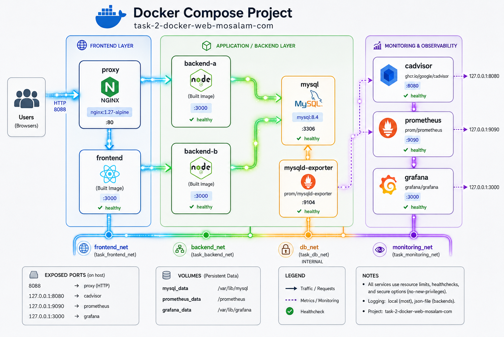

<div align="center">

# Docker Compose Web App with Monitoring

**A modular, production-minded Docker Compose lab featuring an NGINX reverse proxy, a static frontend, two load-balanced Node.js API instances, MySQL persistence, and a complete Prometheus/Grafana monitoring stack.**

[](https://www.docker.com/)
[](https://nodejs.org/)
[](https://nginx.org/)
[](https://www.mysql.com/)
[](https://prometheus.io/)
[](https://grafana.com/)

[Features](#-key-features) · [Architecture](#-architecture) · [Quick Start](#-quick-start) · [API](#-api-reference) · [Monitoring](#-monitoring-and-observability) · [Troubleshooting](#-troubleshooting)

</div>

---

## Overview

This repository demonstrates how to build and operate a complete containerized web platform using **Docker Compose**. It is intentionally split into small Compose files by responsibility, while a root `docker-compose.yml` combines them through Compose `include` directives.

The application is a simple Todo system:

- The browser reaches one public entry point: **NGINX on port `8088`**.
- NGINX serves the frontend and forwards `/api/` requests to two backend instances.
- The backend instances share a persistent MySQL database.
- Prometheus collects application, database, and container metrics.
- Grafana is automatically provisioned with Prometheus as its default data source.
- A resilience/chaos-testing helper under `scripts/` can deliberately generate traffic and trigger failures.

> [!IMPORTANT]
> This project is designed as a local Docker and observability lab. Review the [security notes](#-security-notes) before using it outside a trusted development environment.

## Architecture

<p align="center">
  
</p>

### Request flow

1. A user opens `http://localhost:8088`.
2. The `proxy` container forwards normal web requests to `frontend:80`.
3. Requests under `/api/` are load-balanced across `backend-a:3000` and `backend-b:3000` using NGINX `least_conn`.
4. Both backend instances read from and write to the same MySQL database.
5. Prometheus scrapes the backend metrics endpoint, cAdvisor, MySQL Exporter, and Prometheus itself.
6. Grafana queries Prometheus and loads provisioned dashboards automatically.

### Service inventory

| Service | Image / build | Purpose | Networks |
|---|---|---|---|
| `proxy` | `nginx:1.30.3-alpine` | Public entry point, routing, and API load balancing | `frontend_net`, `backend_net` |
| `frontend` | Built from `frontend/` | Static Todo interface served by NGINX | `frontend_net` |
| `backend-a` | Built from `backend/` | Node.js/Express API instance A | `backend_net`, `db_net`, `monitoring_net` |
| `backend-b` | Built from `backend/` | Node.js/Express API instance B | `backend_net`, `db_net`, `monitoring_net` |
| `mysql` | `mysql:8.4` | Persistent application database | `db_net` |
| `mysqld-exporter` | `prom/mysqld-exporter:v0.19.0` | Exposes MySQL metrics for Prometheus | `db_net`, `monitoring_net` |
| `cadvisor` | `ghcr.io/google/cadvisor:v0.60.5` | Container CPU, memory, filesystem, and network metrics | `monitoring_net` |
| `prometheus` | `prom/prometheus:v3.5.5` | Metrics collection and seven-day time-series retention | `monitoring_net` |
| `grafana` | `grafana/grafana:13.1.0` | Dashboards and metric visualization | `monitoring_net` |

## Key Features

- **Modular Compose configuration** split into application, proxy, database, monitoring, and shared infrastructure files.
- **Single application entry point** through NGINX on port `8088`.
- **Backend load balancing** across two identical Node.js containers using `least_conn`.
- **Persistent MySQL storage** with automatic database initialization.
- **Application metrics** using `prom-client`, including request count and latency histograms.
- **Container metrics** collected by cAdvisor.
- **MySQL observability** through MySQL Exporter.
- **Automatic Grafana provisioning** for the Prometheus data source and dashboard directory.
- **Health-aware startup** using service health checks and `depends_on` conditions.
- **Restart policies** suited to each service’s role.
- **CPU and memory limits** for every major container.
- **Log rotation** using Docker `local` and `json-file` drivers.
- **Network isolation**, including an internal-only database network.
- **Security hardening** with `no-new-privileges` on non-privileged services.
- **Failure testing** through a deliberate backend crash endpoint and the helper under `scripts/`.

## Repository Structure

```text
.
├── backend/
│   ├── Dockerfile
│   ├── package.json
│   └── src/
│       └── server.js
├── composefiles/
│   ├── .env
│   ├── app.yaml
│   ├── database.yaml
│   ├── monitoring.yaml
│   ├── proxy.yaml
│   └── shared.yaml
├── db/
│   ├── README
│   └── init/                  # MySQL initialization SQL
├── frontend/
│   ├── Dockerfile
│   ├── app.js
│   ├── default.conf
│   ├── index.html
│   └── styles.css
├── monitoring/
│   ├── README
│   ├── prometheus/
│   │   └── prometheus.yml
│   └── grafana/
│       ├── dashboards/
│       └── provisioning/
│           ├── dashboards/
│           │   └── dashboard.yml
│           └── datasources/
│               └── prometheus.yml
├── proxy/
│   ├── README
│   └── nginx.conf
├── scripts/
│   └── README                # Resilience and chaos-testing notes
├── docs/
│   └── architecture.svg
└── docker-compose.yml
```

## Prerequisites

- Docker Engine
- Docker Compose v2 with support for the `include` directive
- Git
- A Linux Docker host for the repository’s current cAdvisor host mounts and `/dev/kmsg` device mapping

Verify the installation:

```bash
docker --version
docker compose version
```

## Quick Start

### 1. Clone the repository

```bash
git clone https://github.com/Mohamed0Mourad/Docker-Compose-Web-App-With-Monitoring.git
cd Docker-Compose-Web-App-With-Monitoring
```

### 2. Review the environment configuration

The included Compose files read application secrets and settings from:

```text
composefiles/.env
```

Replace the sample values before starting the stack:

```dotenv
MYSQL_ROOT_PASSWORD=replace-with-a-strong-root-password
MYSQL_DATABASE=taskdb
MYSQL_USER=taskuser
MYSQL_PASSWORD=replace-with-a-strong-app-password

MYSQL_EXPORTER_USER=exporter
MYSQL_EXPORTER_PASSWORD=replace-with-a-strong-exporter-password

API_PORT=3000

GRAFANA_ADMIN_USER=admin
GRAFANA_ADMIN_PASSWORD=replace-with-a-strong-grafana-password
```

> [!WARNING]
> The repository currently contains sample credentials for demonstration. Never commit real production secrets. The MySQL exporter credentials must also match the exporter account created by the SQL file under `db/init/`.

### 3. Validate the combined Compose model

```bash
docker compose config
```

This renders and validates the root file together with all files under `composefiles/`.

### 4. Build and start the platform

```bash
docker compose up -d --build
```

### 5. Confirm service health

```bash
docker compose ps
```

All services should eventually report `running` or `healthy`. MySQL and Grafana intentionally have longer startup periods than the lightweight services.

### 6. Open the application

```text
http://localhost:8088
```

## Access URLs

| Component | URL | Exposure |
|---|---|---|
| Web application | `http://localhost:8088` | All host interfaces |
| Proxy health check | `http://localhost:8088/healthz` | Through the public proxy port |
| Backend health through proxy | `http://localhost:8088/api/health` | Through NGINX |
| cAdvisor | `http://127.0.0.1:8080` | Loopback only |
| Prometheus | `http://127.0.0.1:9090` | Loopback only |
| Prometheus targets | `http://127.0.0.1:9090/targets` | Loopback only |
| Grafana | `http://127.0.0.1:3000` | Loopback only |

## API Reference

The proxy removes the `/api/` prefix before forwarding requests to the backend.

### Health and backend identity

```http
GET /api/health
```

```bash
curl -s http://localhost:8088/api/health
```

Example response:

```json
{
  "status": "ok",
  "db": "up",
  "instance": "backend-a",
  "uptime": 123.45
}
```

Run several requests to observe the backend instance field:

```bash
for i in {1..10}; do
  curl -s http://localhost:8088/api/health
  echo
done
```

### List Todo items

```http
GET /api/todos
```

```bash
curl -s http://localhost:8088/api/todos
```

### Create a Todo item

```http
POST /api/todos
Content-Type: application/json
```

```bash
curl -s -X POST http://localhost:8088/api/todos \
  -H 'Content-Type: application/json' \
  -d '{"title":"Verify Docker health checks"}'
```

### Application metrics

```http
GET /api/metrics
```

```bash
curl -s http://localhost:8088/api/metrics | head
```

### Trigger a backend restart test

```http
POST /api/crash
```

```bash
curl -s -X POST http://localhost:8088/api/crash
```

This endpoint exits the backend process shortly after responding. The affected backend uses `restart: on-failure:5`, allowing you to observe recovery, proxy behavior, health checks, and monitoring.

> [!CAUTION]
> Use `/api/crash` only in a controlled test environment.

## Monitoring and Observability

### Prometheus scrape targets

Prometheus uses a five-second scrape interval and collects metrics from:

| Job | Target(s) | Metrics |
|---|---|---|
| `prometheus` | `prometheus:9090` | Prometheus health and internal metrics |
| `cadvisor` | `cadvisor:8080` | Container resource metrics |
| `backend-api` | `backend-a:3000`, `backend-b:3000` | Node.js and custom HTTP metrics |
| `mysql` | `mysqld-exporter:9104` | MySQL server metrics |


### Grafana provisioning

Grafana starts with:

- Prometheus configured as the default data source at `http://prometheus:9090`.
- File-based dashboard provisioning from `/var/lib/grafana/dashboards`.
- User self-registration disabled.
- Persistent state stored in the `grafana_data` volume.

Sign in using the values configured in `composefiles/.env`.

### Application metrics

Each backend exposes Node.js default metrics with the `nodejs_` prefix and two custom metric families:

- `http_requests_total` — request counter labeled by method, route, status code, and backend instance.
- `http_request_duration_seconds` — request latency histogram with the same labels.

## Networks and Isolation

| Network | Purpose | Attached services |
|---|---|---|
| `task_frontend_net` | Proxy-to-frontend communication | `proxy`, `frontend` |
| `task_backend_net` | Proxy-to-API communication | `proxy`, `backend-a`, `backend-b` |
| `task_db_net` | Application and exporter access to MySQL | `backend-a`, `backend-b`, `mysql`, `mysqld-exporter` |
| `task_monitoring_net` | Metrics collection and visualization | Backends, exporter, cAdvisor, Prometheus, Grafana |

`db_net` is declared with `internal: true`, so its containers cannot use that network as a route to external destinations.

## Persistent Volumes

| Volume | Container path | Stores |
|---|---|---|
| `mysql_data` | `/var/lib/mysql` | Database files and Todo records |
| `prometheus_data` | `/prometheus` | Prometheus time-series data |
| `grafana_data` | `/var/lib/grafana` | Grafana state, users, and settings |

List the project volumes:

```bash
docker volume ls | grep -E 'mysql_data|prometheus_data|grafana_data'
```

## Health Checks and Startup Order

The platform uses health checks instead of relying only on container process state:

- `frontend` and `proxy` expose plain-text `/healthz` endpoints.
- Each backend checks `/health` and verifies database connectivity.
- MySQL uses `mysqladmin ping`.
- MySQL Exporter verifies that `mysql_up` equals `1`.
- cAdvisor uses its bundled health-check script.
- Prometheus uses `promtool check healthy`.
- Grafana checks `/api/health`.

The proxy starts only after the frontend and both backends are healthy. Backends and MySQL Exporter wait for MySQL health, while Grafana waits for Prometheus health.

## Resource Governance

| Service | CPU limit | Memory limit | Restart policy |
|---|---:|---:|---|
| `proxy` | `0.30` | `128m` | `always` |
| `frontend` | `0.25` | `96m` | `unless-stopped` |
| `backend-a` | `0.50` | `256m` | `on-failure:5` |
| `backend-b` | `0.50` | `256m` | `on-failure:5` |
| `mysql` | `0.80` | `768m` | `unless-stopped` |
| `mysqld-exporter` | `0.20` | `96m` | `unless-stopped` |
| `cadvisor` | `0.35` | `256m` | `unless-stopped` |
| `prometheus` | `0.50` | `512m` | `unless-stopped` |
| `grafana` | `0.40` | `384m` | `unless-stopped` |

## Logging

Most services use Docker’s `local` logging driver. The backend instances use `json-file`. Both configurations rotate logs after `10m` and retain three files.

Follow all service logs:

```bash
docker compose logs -f --tail=100
```

Follow selected services:

```bash
docker compose logs -f proxy backend-a backend-b mysql
```

Inspect one container’s logging configuration:

```bash
docker inspect task_backend_a --format '{{json .HostConfig.LogConfig}}'
```

## Resilience and Chaos Testing

The `scripts/` directory documents a local failure-testing workflow that can:

- Check container status.
- Generate sample application traffic.
- Trigger the backend crash endpoint.
- Force-stop MySQL and observe restart behavior.
- Display live container resource consumption.

Before using any destructive test, inspect the script and run it only against this local lab environment.

You can also test recovery manually:

```bash
# Trigger one backend process failure through the load balancer
curl -s -X POST http://localhost:8088/api/crash

# Watch status and restart count
watch -n 1 'docker compose ps'

# Observe logs
docker compose logs -f backend-a backend-b proxy
```

## Common Operations

### View the final merged configuration

```bash
docker compose config
```

### Rebuild application images

```bash
docker compose up -d --build frontend backend-a backend-b
```

### Restart one service

```bash
docker compose restart prometheus
```

### Check resource usage

```bash
docker stats
```

### Stop without deleting data

```bash
docker compose down
```

### Delete containers and persistent data

```bash
docker compose down -v
```

> [!CAUTION]
> `docker compose down -v` permanently removes the MySQL, Prometheus, and Grafana volumes created by this project.

## Database Backup and Restore

### Backup

```bash
docker compose exec -T mysql sh -c \
  'exec mysqldump -uroot -p"$MYSQL_ROOT_PASSWORD" "$MYSQL_DATABASE"' \
  > mysql-backup.sql
```

### Restore

```bash
cat mysql-backup.sql | docker compose exec -T mysql sh -c \
  'exec mysql -uroot -p"$MYSQL_ROOT_PASSWORD" "$MYSQL_DATABASE"'
```

### Re-run initialization scripts

MySQL executes files under `/docker-entrypoint-initdb.d` only when its data directory is initialized for the first time. To rebuild the database from the initialization scripts:

```bash
docker compose down -v
docker compose up -d
```

This deletes all existing database data.

## Security Notes

The project already includes several useful controls:

- MySQL is not published to the host.
- The database network is internal.
- cAdvisor, Prometheus, and Grafana are bound to `127.0.0.1`.
- User self-registration is disabled in Grafana.
- `no-new-privileges` is enabled for the application, database, exporter, Prometheus, and Grafana containers.
- Configuration mounts are read-only where appropriate.

Before deployment beyond a local lab:

1. Replace all sample credentials and remove secrets from Git history.
2. Use Docker secrets or an external secret manager.
3. Add TLS termination and authentication at the proxy layer.
4. Restrict the public application port with a firewall or upstream load balancer.
5. Review cAdvisor carefully: it runs privileged and mounts sensitive host paths.
6. Pin built application dependencies with a lock file and use reproducible installs.
7. Add image vulnerability scanning and CI checks.
8. Back up persistent volumes and test restoration.
9. Avoid exposing Prometheus, cAdvisor, or Grafana directly to untrusted networks.

## Troubleshooting

### Compose reports that `include` is unsupported

Update the Docker Compose v2 plugin, then verify:

```bash
docker compose version
docker compose config
```

### A container remains unhealthy

```bash
docker compose ps
docker inspect task_backend_a --format '{{json .State.Health}}'
docker compose logs --tail=200 backend-a mysql
```

### MySQL Exporter reports `mysql_up 0`

Check that:

- `MYSQL_EXPORTER_USER` and `MYSQL_EXPORTER_PASSWORD` match the account created under `db/init/`.
- The MySQL initialization script ran on a new `mysql_data` volume.
- The exporter can resolve `mysql` on `db_net`.

```bash
docker compose logs mysqld-exporter mysql
```

When exporter credentials are changed after MySQL has already initialized, update the MySQL account manually or recreate the database volume in a disposable environment.

### Prometheus target is down

Open `http://127.0.0.1:9090/targets`, then inspect the relevant service:

```bash
docker compose logs prometheus cadvisor mysqld-exporter backend-a backend-b
```

### Grafana starts but shows no data

Verify the provisioned Prometheus data source and confirm Prometheus targets are healthy:

```bash
docker compose logs grafana prometheus
```

The configured data-source URL must remain `http://prometheus:9090` inside the Docker network, not `localhost:9090`.

### Monitoring pages are inaccessible remotely

The monitoring ports are deliberately bound to the host loopback address. Access them locally, use an SSH tunnel, or place them behind an authenticated reverse proxy rather than changing the bindings without protection.

### cAdvisor fails on Docker Desktop or a non-Linux host

The current service definition uses Linux-specific host paths and `/dev/kmsg`. Adapt the mounts and device configuration to the Docker host, or run the stack on a Linux VM.


## Author

Created by [Mohamed0Mourad](https://github.com/Mohamed0Mourad).

---

<div align="center">
  <sub>Built to demonstrate container orchestration, service isolation, resilience, persistence, and observability with Docker Compose.</sub>
</div>
